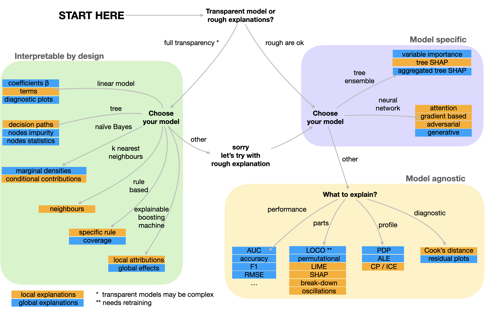
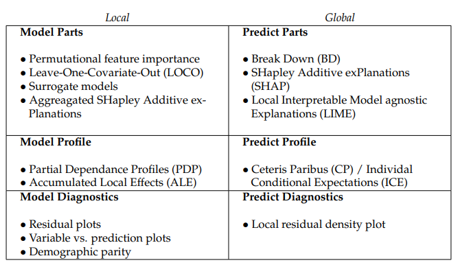
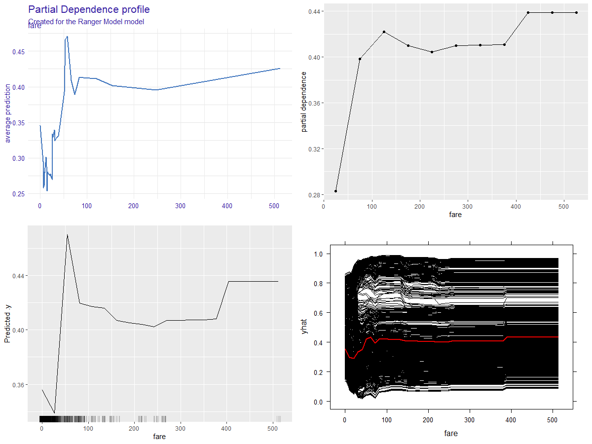
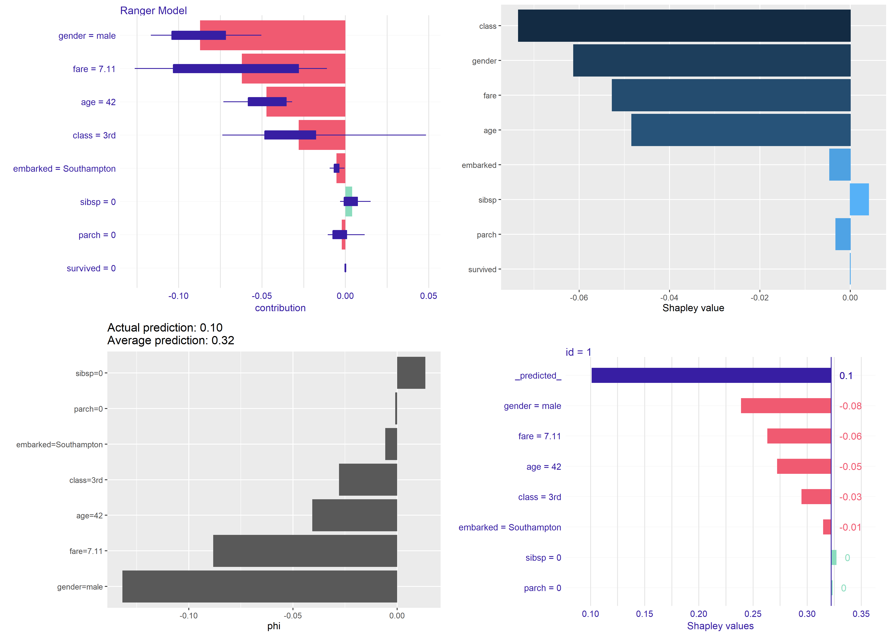

This repository is a landing page for  the article: [Szymon Maksymiuk](https://www.linkedin.com/in/szymon-maksymiuk/), [Alicja Gosiewska](https://www.linkedin.com/in/alicja-gosiewska/), and [Przemysław Biecek](https://www.linkedin.com/in/pbiecek/). *Landscape of R packages for eXplainable Artificial Intelligence*. It contains data and code necessary to reproduce all analysis made in the paper.

# Video 

<a href="https://youtu.be/C7ac4A1t7sc?t=2763">Find a short introduction to this work in this talk presented at WhyR 2020. </a>.


# Abstract 

*The growing availability of data and computing power fuels the development of predictive models. In order to ensure the safe and effective functioning of such models, we need methods for exploration, debugging, and validation. New methods and tools for this purpose are being developed within the eXplainable Artificial Intelligence (XAI) subdomain of machine learning.*
*In this work (1) we present the taxonomy of methods for model explanations, (2) we identify and compare 27 packages available in R to perform XAI analysis, (3) we present an example of an application of particular packages, (4) we acknowledge recent trends in XAI. The article is primarily devoted to the tools available in R, but since it is easy to integrate the Python code, we will also show examples for the most popular libraries from Python.*

# Proposed taxonomy

An important part of our article is a discussion about Taxonomies for predictive machine learning model explanations. We divided them into three branches, ie. models interpretable by design, model-specific explanations, and model-agnostics explanations. Visualization of our ideas can be seen in the figure below



Furthermore, model-specific and model-agnostic were divided according to XAI taxonomy we propose as a new way to categorize predictive model explanations. 
<center>

</center>

# Packages demo 

During the work under the article, we have created a markdown with an example of usage of every compared package. The results can be seen below. As teaser figures used in the article are presented.


<center><font size="+2">

|                                                                                       |                             |                                                                                                   |                             |                                                                                                           |
|---------------------------------------------------------------------------------------|-----------------------------|---------------------------------------------------------------------------------------------------|-----------------------------|-----------------------------------------------------------------------------------------------------------|
| <a href="https://mi2datalab\.github\.io/XAI\-tools/ALEplot\.html">ALEplot</a>         | &nbsp; &nbsp; &nbsp; &nbsp; | <a href="https://mi2datalab\.github\.io/XAI\-tools/arules\.html">arules</a>                       | &nbsp; &nbsp; &nbsp; &nbsp; |  <a href="https://mi2datalab\.github\.io/XAI\-tools/auditor\.html">auditor</a>                            |
| <a href="https://mi2datalab\.github\.io/XAI\-tools/ctree\.html">ctree</a>             | &nbsp; &nbsp; &nbsp; &nbsp; | <a href="https://mi2datalab\.github\.io/XAI\-tools/DALEX\.html">DALEX</a>                         | &nbsp; &nbsp; &nbsp; &nbsp; | <a href="https://mi2datalab\.github\.io/XAI\-tools/DALEXtra\.html">DALEXtra</a>                           |
|  <a href="https://mi2datalab\.github\.io/XAI\-tools/EIX\.html">EIX</a>                | &nbsp; &nbsp; &nbsp; &nbsp; | <a href="https://mi2datalab\.github\.io/XAI\-tools/ExplainPrediction\.html">ExplainPrediction</a> | &nbsp; &nbsp; &nbsp; &nbsp; | <a href="https://mi2datalab\.github\.io/XAI\-tools/fairness\.html">fairness</a>                           |
| <a href="https://mi2datalab\.github\.io/XAI\-tools/fastshap\.html">fastshap</a>       | &nbsp; &nbsp; &nbsp; &nbsp; | <a href="https://mi2datalab\.github\.io/XAI\-tools/flashlight\.html">flashlight</a>               | &nbsp; &nbsp; &nbsp; &nbsp; | <a href="https://mi2datalab\.github\.io/XAI\-tools/forestmodel\.html">forestmodel</a>                     |
| <a href="https://mi2datalab\.github\.io/XAI\-tools/fscaret\.html">fscaret</a>         | &nbsp; &nbsp; &nbsp; &nbsp; | <a href="https://mi2datalab\.github\.io/XAI\-tools/glmnet\.html">glmnet</a>                       | &nbsp; &nbsp; &nbsp; &nbsp; | <a href="https://mi2datalab\.github\.io/XAI\-tools/iBreakDown\.html">iBreakDown</a>                       |
| <a href="https://mi2datalab\.github\.io/XAI\-tools/ICEbox\.html">ICEbox</a>           | &nbsp; &nbsp; &nbsp; &nbsp; | <a href="https://mi2datalab\.github\.io/XAI\-tools/iml\.html">iml</a>                             | &nbsp; &nbsp; &nbsp; &nbsp; | <a href="https://mi2datalab\.github\.io/XAI\-tools/ingredients\.html">ingredients</a>                     |
| <a href="https://mi2datalab\.github\.io/XAI\-tools/kknn\.html">kknn</a>               | &nbsp; &nbsp; &nbsp; &nbsp; | <a href="https://mi2datalab\.github\.io/XAI\-tools/naivebayes\.html">naivebayes</a>               | &nbsp; &nbsp; &nbsp; &nbsp; | <a href="https://mi2datalab\.github\.io/XAI\-tools/lime\.html">lime</a>                                   |
| <a href="https://mi2datalab\.github\.io/XAI\-tools/live\.html">live</a>               | &nbsp; &nbsp; &nbsp; &nbsp; | <a href="https://mi2datalab\.github\.io/XAI\-tools/mcr\.html">mcr</a>                             | &nbsp; &nbsp; &nbsp; &nbsp; | <a href="https://mi2datalab\.github\.io/XAI\-tools/modelDown\.html">modelDown</a>                         |
| <a href="https://mi2datalab\.github\.io/XAI\-tools/modelStudio\.html">modelStudio</a> | &nbsp; &nbsp; &nbsp; &nbsp; | <a href="https://mi2datalab\.github\.io/XAI\-tools/pdp\.html">pdp</a>                             | &nbsp; &nbsp; &nbsp; &nbsp; | <a href="https://mi2datalab\.github\.io/XAI\-tools/randomForestExplainer\.html">randomForestExplainer</a> |
| <a href="https://mi2datalab\.github\.io/XAI\-tools/shapper\.html">shapper</a>         | &nbsp; &nbsp; &nbsp; &nbsp; | <a href="https://mi2datalab\.github\.io/XAI\-tools/smbinning\.html">smbinning</a>                 | &nbsp; &nbsp; &nbsp; &nbsp; | <a href="https://mi2datalab\.github\.io/XAI\-tools/survxai\.html">survxai</a>                             |
| <a href="https://mi2datalab\.github\.io/XAI\-tools/vip\.html">vip</a>                 | &nbsp; &nbsp; &nbsp; &nbsp; | <a href="https://mi2datalab\.github\.io/XAI\-tools/vivo\.html">vivo</a>                           | &nbsp; &nbsp; &nbsp; &nbsp; |                                                                                                           |

</font></center>
<center>
```{r echo=FALSE, fig.cap="Partial Dependence Porfiles for fare variable from the Titanic data set generated with DALEX(top-left), flashlight(right-top), iml(left-bottom), pdp(right-bottom).  We can see that the profiles differs. It is due to the fact that profiles are evaluated on different grids of points.", fig.show='hold'}

```

</center>
<center>
```{r echo=FALSE, fig.cap="Contribution plots based on Shapley values for the same observation from Titanic dataset generated with DALEX (top-left), flashlight (right-top), iml (left-bottom), pdp (right-bottom).", fig.show='hold'}

```
</center>

Versions of all used packages are stored in the renv.lock file and can be restored with the `renv` package.
 
# Contributions


We did our best to show the entire range of the implemented explanations. Please note that the examples may be incomplete. If you think something is missing, feel free to make a pull request in the [XAI-tools](https://github.com/MI2DataLab/XAI-tools) repository.


# Preprint

Preprint for this work is avaliable at https://arxiv.org/abs/2009.13248 .

In order to cite our work please use the following BiBTeX entry

```
@article{xailandscape,
      title={Landscape of R packages for eXplainable Artificial Intelligence}, 
      author={Szymon Maksymiuk and Alicja Gosiewska and Przemyslaw Biecek},
      year={2020},
      journal={arXiv},
      eprint={2009.13248},
      archivePrefix={arXiv},
      primaryClass={cs.LG},
      URL={https://arxiv.org/abs/2009.13248}
}
```
